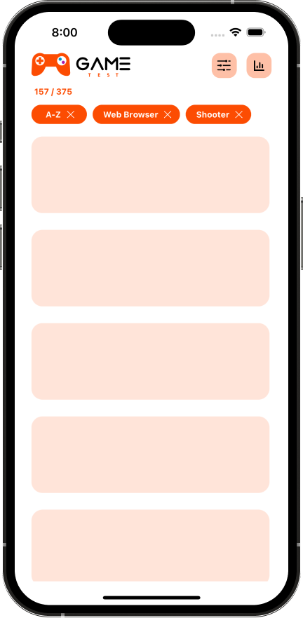

# Game Test

A cross-platform mobile application developed with React Native that displays games in many categories from various game platforms.

## Installation

To install and run the app on your local machine, follow these steps:

1. Clone the repository: `git clone https://github.com/vis-cognitionis/game-test.git`
2. Install dependencies: `npm install`
3. Run the app on an emulator or device: `npm run android` or `npm run ios`

## Technologies 

<li> <a href="https://reactnative.dev/" target="_blank">React Native</a></li> 
<li> <a href="https://beta.reactjs.org/" target="_blank">React</a></li> 
<li> <a href="https://www.typescriptlang.org/" target="_blank">TypeScript</a> </li> 
<li> <a href="https://prettier.io/" target="_blank">Prettier</a> </li> 
<li> <a href="https://www.freetogame.com/api-doc/" target="_blank">FreeToGame API</a> </li> 
<li> <a href="https://tanstack.com/query/latest" target="_blank">TanStack React Query</a> </li> 

## Project Structure

The capabilities of React and the code principles were applied as follows:

- `assets`: Contains images
- `src`: Contains the source code for the app
- `core`: Contains reusable components and constant colors in the project
- `data`: Contains react query functions that allow data from API to be managed from a single place
- `hooks`: Contains filtering and sorting custom hook functions 
- `inteface`: Contains interface object corresponding to data from API
- `state`: Contains ContextAPI and provider constructs that manage states used in components in the project
- `view`: Contains the components and screens of the project

## Project Overview

This project is a game-test React Native TypeScript application. In the first step, a home screen interface where the games are listed was designed in Figma. A logo and name for the app were also determined. Components such as reusable button, modal, chip and card were created for the project. For filtering and sorting operations in a mobile app, a bottom modal screen was chosen.The user can select the desired filters from this model to apply filtering and sorting. In addition, selected filters can be viewed at the top of the main list page and turned off individually. In addition to this, from the statistics graph button in the header, you can access the graphs showing the features such as winning, failing and play time of various games.

The capabilities of React and the code principles were applied as follows:

- Usage of functional components and hooks
- Managing necessary states across the application using `ContextAPI` and a `provider`
- Efficient utilization of filtering and sorting functions using `custom hooks` and making them accessible from all components
- A component has only one responsibility in accordance with the `Single Responsibility Principle`
- Separation of code structure into sub components and styled components by simplified
- Improving performance by using `VirtualizedList` and `React.memo` as well as `useMemo` and `useCallback` hooks in components
- Furthermore, the fetched data was managed from a single source using the `@tanstack/react-query` library

## Screenshots

Here are some example screenshots of the app:

  
   
  <em>Logo and name designed for game testing</em>

   
   

  
   
  <em>Overview from iOS and Android phones</em>

   
   

  
   
  <em>Main screen where games are listed and filter & sort modal</em>

   
   
  

  
   
  <em>Selected filter chips and chips visible on the main screen</em>

   
   

  

  
   
  <em>Dark theme view</em>

   
   

  
   
  <em>The modal screen showing the statistics of the games in comparison</em>

   
   

  
   
  <em>Lazy loading screen</em>

